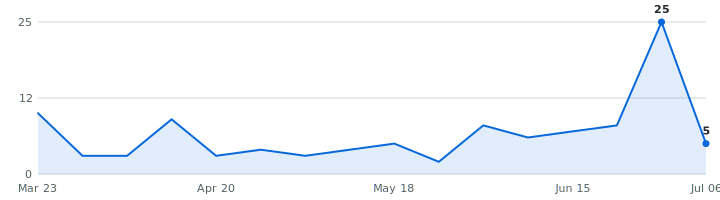

# Summer 2027 Tech Internships

   

A self-updating engine that tracks tech internships so you don't have to. Instead of refreshing a dozen career pages by hand, it reads company hiring feeds directly and keeps one live list, newest roles on top, refreshed automatically throughout the day.

**4 open roles · 4 new this week · 985 companies tracked · updated Jul 24, 2026 at 02:05 UTC**

**⭐Star this repo⭐** to save it and get updates when new roles are added.

**Live:** [dashboard](https://rohan-droid7341.github.io/internship-engine-india/) · [RSS feed](https://rohan-droid7341.github.io/internship-engine-india/feed.xml) (instant alerts in any RSS app) · [JSON API](https://rohan-droid7341.github.io/internship-engine-india/api/jobs.json)

**🔔 New roles in your inbox:** [subscribe by email](https://rohan-droid7341.github.io/internship-engine-india/#subscribe) - one email a day, only when new internships actually appeared, one-click unsubscribe. (Prefer RSS-to-email? [Feedrabbit works too](https://feedrabbit.com/subscriptions/new?url=https%3A%2F%2Fraw.githubusercontent.com%2FRohan-droid7341%2Finternship-engine-india%2Fmain%2Fdocs%2Ffeed.xml).)
---

## Summer 2027 (International)  (4 open)

| Company | Role | Category | Location | Posted | Apply |
|---|---|---|---|---|---|
| Scopely | Intern - Gen. AI Art ~ 🆕 | Data & ML/AI | IN - Bangalore, India | Jul 14, 2026 | [Apply](https://job-boards.greenhouse.io/scopely/jobs/5341537008?gh_jid=5341537008) |
| Stripe | Software Engineer, Intern ~ 🆕 | Software | Bengaluru | Jul 10, 2026 | [Apply](https://stripe.com/jobs/search?gh_jid=8031833) |
| IMC Trading | 2027 - Software Engineering Intern - IIT Bombay 🆕 | Software | Mumbai, India | Jul 06, 2026 | [Apply](https://job-boards.eu.greenhouse.io/imc/jobs/4860319101) |
| IMC Trading | 2027 - Software Engineering Intern - BITS Pilani 🆕 | Software | Mumbai, India | Jul 06, 2026 | [Apply](https://job-boards.eu.greenhouse.io/imc/jobs/4917549101) |

_~ = the title doesn't state a year; bucketed here from its posting date (2 of 4)._

## What this is

This is an engine, not a hand-kept list. It polls company career feeds several times a day, finds the internships, removes duplicates, and rebuilds this page on its own. Every link comes straight from the source, so it's real and current, not a stale list someone forgot to update (speed matters).

## What makes this different

- **📅 [Drop Radar](#drop-radar)** - the only list that shows **what's coming**: each marquee company's typical opening window, then confirmed with the real drop date the moment the engine catches it live.
- **Real posted dates on every role** - pulled from each job portal itself, so newest-first actually means newest.
- **Skill tags + pay, extracted** - every posting's text is scanned for the stack it wants (Python, C++, PyTorch, ...) and the pay it states - searchable on the [dashboard](https://rohan-droid7341.github.io/internship-engine-india/), included in the CSV and API.
- **Alerts your way** - [email digests](https://rohan-droid7341.github.io/internship-engine-india/#subscribe), [RSS](https://rohan-droid7341.github.io/internship-engine-india/feed.xml), or Discord - plus a [live dashboard](https://rohan-droid7341.github.io/internship-engine-india/) with search and custom filters.
- **An engine, not a spreadsheet** - polled every hour across multiple ATS platforms with full source in this repo.

## Scope

- **Roles:** Software Engineering, Data Science & Machine Learning (and closely related technical internships)
- **Region:** United States
- **Cycles:** Summer 2027 and Fall 2026

## About

I built this engine to automate tracking for top-tier tech internships across India and globally remote roles. Use it to spot roles early and apply before they fill up - being first genuinely helps.

## How to use

- Roles are grouped by cycle - **newest posting on top, oldest at the bottom.**
- The **Posted** column is the date the company published the role.
- **Flags:** 🆕 = spotted in the last 48 hours.
- Track your applications with [`data/internships.csv`](data/internships.csv) (opens in Excel / Google Sheets).
- Missing a company? Adding one takes a single line, see [CONTRIBUTING.md](CONTRIBUTING.md).

---

## 📅 Drop Radar — when companies usually post for Summer 2027

Stop refreshing career pages. Every date here is **real or verified** — no third-party list. 🎯 = the engine **saw the drop itself** from the company's own careers API; the rest are hand-checked typical opening windows for marquee names. ✅ = already live in the list above.

> **Heads up:** companies trend *earlier* every cycle, and "~Aug" is a month, not a day. Treat "expected" as when to **start watching**, and "rolling" companies as worth checking year-round.

| Company | Typical opening | Expected this cycle | Status |
|---|---|---|---|
| Citadel | ~Aug | ~Aug · in ~8d | ⏳ waiting |
| Citadel Securities | ~Aug | ~Aug · in ~8d | ⏳ waiting |
| Databricks | ~Aug | ~Aug · in ~8d | ⏳ waiting |
| DoorDash | ~Aug | ~Aug · in ~8d | ⏳ waiting |
| DRW | ~Aug | ~Aug · in ~8d | ⏳ waiting |
| Google | ~Aug | ~Aug · in ~8d | ⏳ waiting |
| Jane Street | ~Aug | ~Aug · in ~8d | ⏳ waiting |
| Meta | ~Aug | ~Aug · in ~8d | ⏳ waiting |
| Optiver | ~Aug | ~Aug · in ~8d | ⏳ waiting |
| Pinterest | ~Aug | ~Aug · in ~8d | ⏳ waiting |
| Salesforce | ~Aug | ~Aug · in ~8d | ⏳ waiting |
| SIG | ~Aug | ~Aug · in ~8d | ⏳ waiting |
| Snowflake | ~Aug | ~Aug · in ~8d | ⏳ waiting |
| Uber | ~Aug | ~Aug · in ~8d | ⏳ waiting |
| Adobe | ~Sep | ~Sep · in ~39d | ⏳ waiting |
| Airbnb | ~Sep | ~Sep · in ~39d | ⏳ waiting |
| Bloomberg | ~Sep | ~Sep · in ~39d | ⏳ waiting |
| Dropbox | ~Sep | ~Sep · in ~39d | ⏳ waiting |
| Plaid | ~Sep | ~Sep · in ~39d | ⏳ waiting |
| Point72 | ~Sep | ~Sep · in ~39d | ⏳ waiting |
| Robinhood | ~Sep | ~Sep · in ~39d | ⏳ waiting |
| Roblox | ~Sep | ~Sep · in ~39d | ⏳ waiting |
| Stripe | ~Sep | ~Sep · in ~39d | ⏳ waiting |
| D.E. Shaw | ~Oct | ~Oct | ⏳ waiting |
| Coinbase | ~Dec | ~Dec | ⏳ waiting |
| Ramp | ~Dec | ~Dec | ⏳ waiting |
| Two Sigma | ~Dec | ~Dec | ⏳ waiting |
| Apple | rolling | year-round | ⏳ waiting |
| Datadog | rolling | year-round | ⏳ waiting |
| Jump Trading | rolling | year-round | ⏳ waiting |

_54 companies on the [full radar](https://rohan-droid7341.github.io/internship-engine-india/#radar). **19** dated from our own live observations 🎯 (this grows every cycle). "~Aug" = hand-verified typical month, not a promise of the day; "rolling" = posts year-round; "waiting" = not seen in our tracked feeds yet, not a guarantee it isn't out somewhere else._

<strong>Recently closed</strong> — 30 roles taken down in the last 14 days

| Company | Role | Cycle | Closed |
|---|---|---|---|
| Amazon | Software Development Engineer Intern, AWS Data Services - Fall 2026 (US) | Fall 2026 | 2026-07-23 |
| Amazon | Software Development Engineer Internship - Fall 2026 (US) | Fall 2026 | 2026-07-23 |
| Amazon | Amazon Industrial Robotics - Applied Scientist II Intern / Co-op - 2026, Amazon Industrial Robotics | Fall 2026 | 2026-07-23 |
| Amazon | Robotics - Software Development Engineer Intern/Co-op - 2026 | Fall 2026 | 2026-07-23 |
| Notion | Software Engineer Intern (Fall 2026) | Fall 2026 | 2026-07-23 |
| Akuna Capital | Software Engineer Intern - C++, Summer 2027 | Summer 2027 | 2026-07-23 |
| Akuna Capital | Software Engineer Intern - Python, Summer 2027 | Summer 2027 | 2026-07-23 |
| Akuna Capital | Platform Engineer Intern, Summer 2027 | Summer 2027 | 2026-07-23 |
| Akuna Capital | Software Engineer Intern - C# .NET Desktop, Summer 2027 | Summer 2027 | 2026-07-23 |
| Akuna Capital | Software Engineer Intern - Full Stack Web, Summer 2027 | Summer 2027 | 2026-07-23 |
| Five Rings | Summer Intern 2027 - Software Developer | Summer 2027 | 2026-07-23 |
| IMC Trading | Software Engineer Intern - Summer 2027 | Summer 2027 | 2026-07-23 |
| IMC Trading | Machine Learning Research Intern - Summer 2027 - Chicago | Summer 2027 | 2026-07-23 |
| Jump Trading | Campus AI Research Engineer (Intern) | Summer 2027 | 2026-07-23 |
| Jump Trading | Campus AI Research Engineer - Deep Learning (Intern) | Summer 2027 | 2026-07-23 |
| Jump Trading | Campus AI Research Engineer – Research Automation (Intern) | Summer 2027 | 2026-07-23 |
| Tower Research Capital | Quantitative Developer Intern - Summer 2027 | Summer 2027 | 2026-07-23 |
| Hudson River Trading | Software Engineering Internship (C++ or Python) – Summer 2027 | Summer 2027 | 2026-07-23 |
| Palantir | Forward Deployed Infrastructure Engineer, Internship - US Government | Summer 2027 | 2026-07-23 |
| Palantir | Year at Palantir - Forward Deployed Software Engineer, Internship - Commercial | Summer 2027 | 2026-07-23 |
| Palantir | Forward Deployed Software Engineer, Internship - Intel | Summer 2027 | 2026-07-23 |
| Palantir | Forward Deployed Software Engineer, Internship - Commercial | Summer 2027 | 2026-07-23 |
| NVIDIA | Applied Research Intern, NLP - Fall 2026 | Fall 2026 | 2026-07-23 |
| NVIDIA | Performance Engineer Intern, Systems Software-  Fall 2026 | Fall 2026 | 2026-07-23 |
| Tencent | Research Intern – Video World Models (Research & ML Systems) | Summer 2027 | 2026-07-23 |
| Intel | AI Software Engineering Intern | Summer 2027 | 2026-07-23 |
| Uber Freight | Data Scientist Intern - Fall 2026 | Fall 2026 | 2026-07-15 |
| NVIDIA | Quantum Error Correction Research Scientist Intern - Fall 2026 | Fall 2026 | 2026-07-13 |
| NVIDIA | Quantum Research Scientist Intern - Fall 2026 | Fall 2026 | 2026-07-13 |
| NVIDIA | Software Engineering Intern, JAX - Fall 2026 | Fall 2026 | 2026-07-13 |

---

## Hiring timeline

Internships posted per week, from each role's real published date - redrawn automatically on every run. When this line takes off, recruiting season is open:

<picture>
  <source media="(prefers-color-scheme: dark)" srcset="docs/trends-dark.svg">
  
</picture>

## How it stays current

A small Python engine reads public company hiring feeds directly, keeps the roles that match the scope above, de-duplicates across sources, records each role's published date once (so it never shifts), and regenerates this page through GitHub Actions. It polls every company concurrently (async) with retry/backoff and per-host rate limits. The full source is in this repo.

_Engine (last run): 985 companies across 13 ATS platforms · 96% fetch success · completed in 59.3s · median detection latency 181 min · real posted dates on 100% of open roles._

## Contributing

Adding a company takes one line, see [CONTRIBUTING.md](CONTRIBUTING.md). Suggestions and pull requests are welcome.

## Note on dates

The **Posted** column shows when a role was published, with the newest at the top. I pull the posting date straight from each job portal, but a lot of them don't expose one publicly, so those rows show a dash (—) for now instead of a guessed date. The ones that do publish a date are dated. Know the real date for a dashed role? Open a PR and I'll merge it.

Roles can close at any time, so always confirm on the company's own site before applying.
