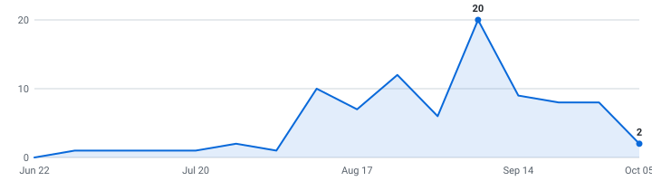

# Indian Tech Internships

   

A self-updating engine that tracks tech internships so you don't have to. Instead of refreshing a dozen career pages by hand, it reads company hiring feeds directly and keeps one live list, newest roles on top, refreshed automatically throughout the day.

**9 open roles · 5 new this week · 5,391 companies tracked · updated Oct 06, 2026 at 17:50 UTC**

**⭐Star this repo⭐** to save it and get updates when new roles are added.

---

## Summer 2027  (9 open)

| Company | Role | Category | Pay & Specs | Location | Posted | Apply |
|---|---|---|---|---|---|---|
| Valeo | Intern - Software ~ 🆕 | Software | — | Chennai | Oct 05, 2026 | [Apply](https://valeo.wd3.myworkdayjobs.com/valeo_jobs/job/Chennai/Intern---Software_REQ2026070899) |
| HackerRank | Software Development Engineer Intern | Software | B.Tech/BS | Onsite in Bangalore | Oct 01, 2026 | [Apply](https://job-boards.greenhouse.io/hackerrank/jobs/8229735) |
| AbhiBus | AI-Native Full Stack Developer Intern ~ | Data & ML/AI | B.Tech/BS | Hyderabad, TS, India | Oct 01, 2026 | [Apply](https://jobs.smartrecruiters.com/abhibus/744000152892832) |
| Marvell | AI Intern ~ | Data & ML/AI | B.Tech/BS | Bangalore | Sep 30, 2026 | [Apply](https://marvell.wd1.myworkdayjobs.com/MarvellCareers2/job/Bangalore/AI-Intern_2604445) |
| Thoughtworks | Software Procurement Intern ~ 🆕 | Software | 0-1 Yr B.Tech/BS | Gurgaon, India; Pune, India | Sep 28, 2026 | [Apply](https://www.thoughtworks.com/careers/jobs/8236673?gh_jid=8236673) |
| Altera Corporation | AI Automation Intern ~ | Data & ML/AI | — | Bengaluru, Karnataka, India | Sep 18, 2026 | [Apply](https://altera.wd1.myworkdayjobs.com/altera/job/Bengaluru-Karnataka-India/AI-Automation-Intern_R03117) |
| Thoughtworks | Developer (Vapasi) - Intern ~ | Software | B.Tech/BS | Bangalore, India | Sep 17, 2026 | [Apply](https://www.thoughtworks.com/careers/jobs/8210384?gh_jid=8210384) |
| Member Solutions | Cybersecurity GRC Intern ~ | Other | B.Tech/BS | India (Jonas Collections and Recovery I… | Dec 22, 2025 | [Apply](https://talentmanagementsolution.wd3.myworkdayjobs.com/JonasSoftwareUSA/job/India-Jonas-Collections-and-Recovery-Inc/Cybersecurity-GRC-Intern_R47560) |
| Valeo | Intern - AI ~ | Data & ML/AI | — | Chennai | Aug 06, 2025 | [Apply](https://valeo.wd3.myworkdayjobs.com/valeo_jobs/job/Chennai/Intern---AI_REQ2025061319) |

_~ = the title doesn't state a year; bucketed here from its posting date (8 of 9)._

## What this is

This is an engine, not a hand-kept list. It polls company career feeds several times a day, finds the internships, removes duplicates, and rebuilds this page on its own. Every link comes straight from the source, so it's real and current, not a stale list someone forgot to update (speed matters).

## What makes this different

- **Real posted dates on every role** - pulled from each job portal itself, so newest-first actually means newest.
- **Skill tags + pay, extracted** - every posting's text is scanned for the stack it wants (Python, C++, PyTorch, ...) and the pay it states - searchable on the [dashboard](https://rohan-droid7341.github.io/internship-engine-india/), included in the CSV and API.
- **Alerts your way** - [email digests](https://rohan-droid7341.github.io/internship-engine-india/#subscribe), [RSS](https://rohan-droid7341.github.io/internship-engine-india/feed.xml), or Discord - plus a [live dashboard](https://rohan-droid7341.github.io/internship-engine-india/) with search and custom filters.
- **An engine, not a spreadsheet** - polled every hour across multiple ATS platforms with full source in this repo.

## Scope

- **Roles:** Software Engineering, Data Science & Machine Learning (and closely related technical internships)
- **Region:** India & Verified Remote
- **Cycles:** Summer 2027 and Fall 2026

## About

I built this engine to automate tracking for top-tier tech internships across India and globally remote roles. Use it to spot roles early and apply before they fill up - being first genuinely helps.

## How to use

- Roles are grouped by cycle - **newest posting on top, oldest at the bottom.**
- The **Posted** column is the date the company published the role.
- **Flags:** 🆕 = spotted in the last 48 hours.
- Track your applications with [`data/internships.csv`](data/internships.csv) (opens in Excel / Google Sheets).
- Missing a company? Adding one takes a single line, see [CONTRIBUTING.md](CONTRIBUTING.md).

---

<strong>Recently closed</strong> — 13 roles taken down in the last 14 days

| Company | Role | Cycle | Closed |
|---|---|---|---|
| Marvell | Software QA Automation Intern | Summer 2027 | 2026-10-06 |
| GE Aerospace | Data Science -Intern | Summer 2027 | 2026-10-05 |
| Marvell | Intern, Software QA Engineer | Summer 2027 | 2026-10-04 |
| Marvell | Intern, Software Engineer | Summer 2027 | 2026-10-02 |
| Thoughtworks | Software Procurement Intern | Summer 2027 | 2026-10-01 |
| AbhiBus | AI-Native Full Stack Developer Intern | Summer 2027 | 2026-09-28 |
| Sprinklr | ML Intern | Summer 2027 | 2026-09-25 |
| Marvell | AI Intern | Summer 2027 | 2026-09-24 |
| Pearson | Apprentice, Software Engineer | Summer 2027 | 2026-09-24 |
| Arista Networks | Junior AI-Assisted Automation Scripting Associate (Apprentice) | Summer 2027 | 2026-09-24 |
| GE Aerospace | Data Science Intern | Summer 2027 | 2026-09-23 |
| Ixigo | Full-Stack Intern - B2B | Summer 2027 | 2026-09-23 |
| Philips | Intern – Data Science and AI Engineering | Summer 2027 | 2026-09-22 |

---

## Hiring timeline

Internships posted per week, from each role's real published date - redrawn automatically on every run. When this line takes off, recruiting season is open:

<picture>
  <source media="(prefers-color-scheme: dark)" srcset="docs/trends-dark.svg">
  
</picture>

## How it stays current

A small Python engine reads public company hiring feeds directly, keeps the roles that match the scope above, de-duplicates across sources, records each role's published date once (so it never shifts), and regenerates this page through GitHub Actions. It polls every company concurrently (async) with retry/backoff and per-host rate limits. The full source is in this repo.

_Engine (last run): 5,391 companies across 18 ATS platforms · 98% fetch success · completed in 396.0s · median detection latency 662 min · real posted dates on 100% of open roles._

## Platforms Scraped

The engine currently extracts live data from the following platforms:
- **Direct ATS (Applicant Tracking Systems):** Greenhouse, Lever, Ashby, SmartRecruiters, Workable, Workday, Breezy, Recruitee, Rippling, Eightfold, Oracle
- **Direct Enterprise & Custom Scrapers:** Amazon (India Jobs), Custom Playwright Scrapers (Flipkart, Swiggy, Razorpay, CRED, InMobi, Rapido, Blinkit, Groww, CARS24, Urban Company, Delhivery)
- **Indian Job Portals & Aggregators:** Internshala, Naukri, Wellfound

## Contributing

Adding a company takes one line, see [CONTRIBUTING.md](CONTRIBUTING.md). Suggestions and pull requests are welcome.

## Note on dates

The **Posted** column shows when a role was published, with the newest at the top. I pull the posting date straight from each job portal, but a lot of them don't expose one publicly, so those rows show a dash (—) for now instead of a guessed date. The ones that do publish a date are dated. Know the real date for a dashed role? Open a PR and I'll merge it.

Roles can close at any time, so always confirm on the company's own site before applying.
